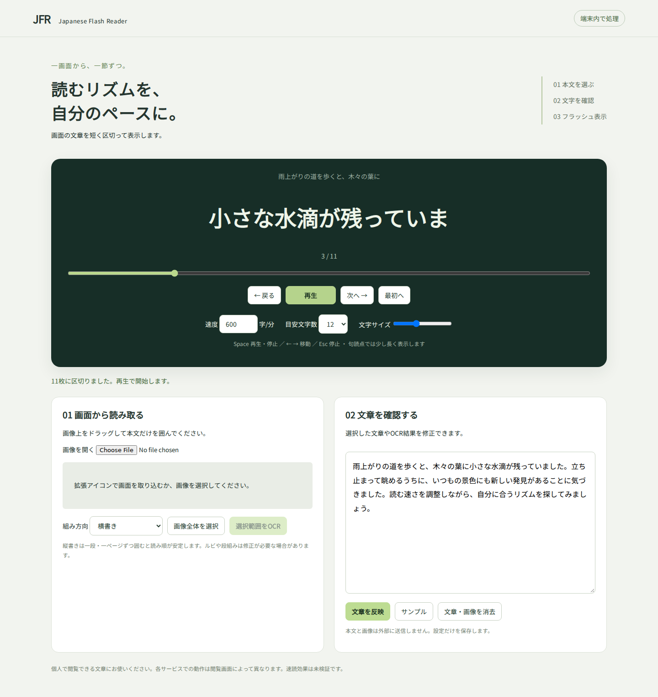

# Japanese Flash Reader

日本語の文章を短いカードに区切り、一定のペースで表示するChrome / Edge拡張です。選択文章、貼り付け文章、画面のスクリーンショットに対応します。

hontoなどのブラウザ型電子書籍ビューアでの利用を想定し、表示中の画面から範囲を選んで日本語OCRを行えます。**各電子書籍サービスの実画面での動作検証は未実施です。** v0.2.0は検証用の初期版です。



## 機能

- 拡張アイコンから、アクティブなタブの表示画面と選択中の文章を取り込み
- ドラッグによる本文範囲の指定、画像ファイルの読み込み
- 横書き・縦書き（右から左）の日本語OCR
- OCR結果を編集し、日本語の単語境界と助詞を参考にカードへ分割
- 120〜2400字/分の速度設定、句読点での待ち時間追加
- 一時停止、前後移動、位置スライダー、文字サイズ変更
- タブを離れたときの自動停止
- OCRは同梱モデルによって端末内で実行。APIキー不要

表示速度は句読点の待ち時間を加える前の目安です。カードの分割はヒューリスティックです。速読効果・読解力への影響は検証していません。

## インストール

### ビルド済み配布物

1. このリポジトリの `japanese-flash-reader-extension-v0.2.0.zip` をダウンロードして展開します。
2. Chromeの `chrome://extensions` またはEdgeの `edge://extensions` を開きます。
3. デベロッパーモードを有効にします。
4. 「パッケージ化されていない拡張機能を読み込む」で、`manifest.json` が入ったフォルダを選択します。
5. 拡張機能をツールバーに固定します。

### ソースからビルド

Node.js 22 LTSを推奨します。

```sh
npm ci --ignore-scripts
npm test
npm run build
```

作成された `dist` を上記の手順で読み込みます。モデルを含む依存ファイルの取得はビルド時に行います。実行時にCDNからコードを取得する構成は使用していません。

## hontoなどでの使い方

1. 対応書籍をサービスのブラウザビューアで開きます。
2. 読みたいページを表示して、Japanese Flash Readerの拡張アイコンを押します（`Alt+Shift+Y` も使用可能）。
3. 新しく開いたタブで、スクリーンショットの本文をドラッグして囲みます。
4. 「横書き」または「縦書き」を選び、「選択範囲をOCR」を押します。
5. OCR結果の誤字や読み順を確認・修正し、「文章を反映」→「再生」を押します。
6. 続きは元の電子書籍タブでページを送り、再度拡張アイコンを押します。

文字を選択できるページでは、選択後に拡張アイコンを押すと、その文章が入力されます。文章の貼り付けや画像の読み込みも利用できます。

### 縦書きのコツ

本文を一段・一ページずつ囲んでください。見開きは右ページから順に取り込みます。ルビ、段組み、小さい文字、背景模様、特殊なフォントは誤認識の原因になります。ブラウザやビューアで文字を大きくし、本文以外のUIを範囲から外すと改善する場合があります。

## 対応範囲と制限

| 入力 | 実装 | 検証状況 |
|---|---|---|
| 貼り付け文章 | 対応 | 分割の自動テストあり |
| 通常のWebページの選択文章 | 対応 | サービスごとに要確認 |
| スクリーンショット・画像 | 範囲選択と日本語OCR | 下記の検証記録参照 |
| hontoのブラウザビューア | 表示画面をOCRする設計 | 購入済み書籍では未検証 |
| その他の電子書籍サービス | 表示画面をOCRする設計 | 未検証 |
| ブラウザ表示中のPDF | 表示領域の画像をOCRする設計 | 未検証、ローカルファイルは拡張のファイルアクセス許可が必要な場合あり |
| 電子書籍の専用アプリ | スクリーンショット画像を手動入力 | アプリ画面の直接取得は未実装 |

画面の撮影が制限されている環境では使えません。ページ送りは手動です。複数ページの自動収集、全文抽出、暗号化ファイルの復号、電子書籍ファイルの変換機能はありません。自分が閲覧でき、利用が認められた文章に使用し、書籍本文や撮影画像をリポジトリへ投稿しないでください。

honto等の運営会社とは関係のない独立したプロジェクトです。

## キーボード

文章入力欄やボタンにフォーカスがない状態で使用できます。

| キー | 操作 |
|---|---|
| Space | 再生 / 停止 |
| ← / → | 前 / 次のカードへ移動して停止 |
| Esc | 停止 |

## 開発

ルート直下に拡張本体、`build.mjs` に依存ファイル同梱処理、`segment.test.mjs` に文章分割・時間計算・範囲選択のテストがあります。

```sh
npm test
npm run build
```

詳細は [PRIVACY.md](PRIVACY.md)、[THIRD_PARTY_NOTICES.md](THIRD_PARTY_NOTICES.md)、[TESTING.md](TESTING.md) を参照してください。

## ライセンス

プロジェクトのソースはMIT。OCR関連の依存物にはそれぞれのライセンスが適用されます。

## 参考

- [honto ブラウザビューア](https://honto.jp/ebook/dlinfo/browserviewer.html)
- [Chrome tabs API](https://developer.chrome.com/docs/extensions/reference/api/tabs)
- [Tesseract.js](https://github.com/naptha/tesseract.js)
